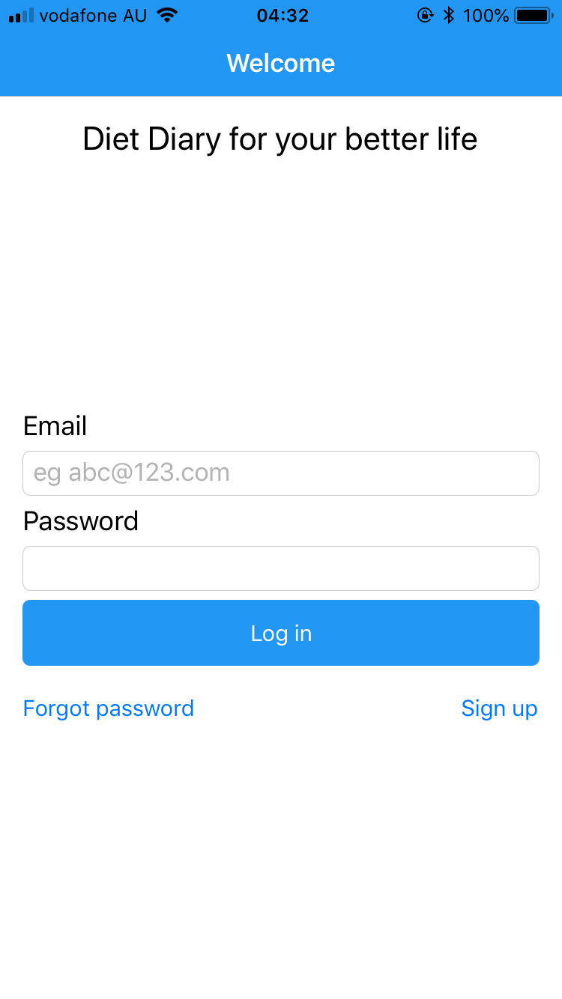
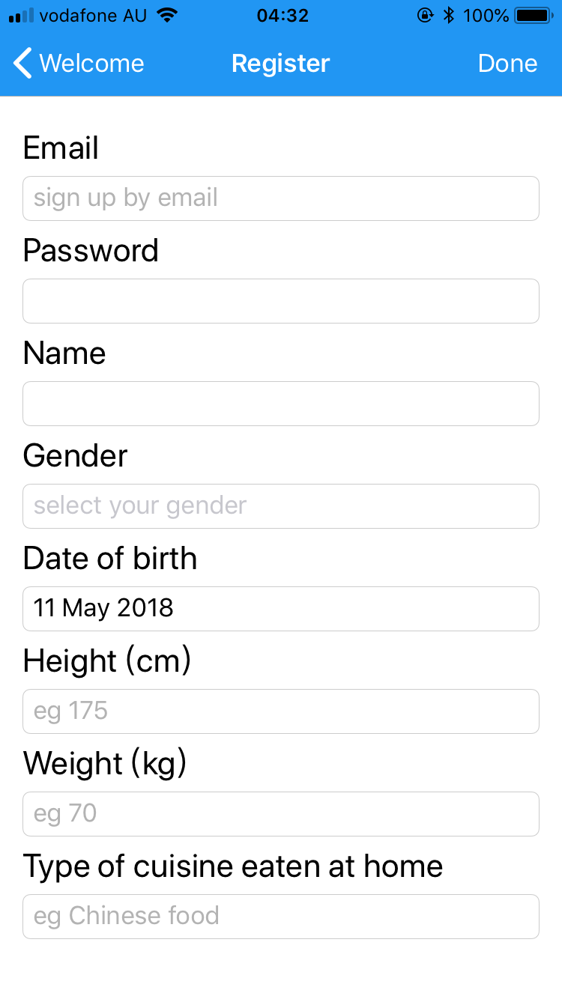
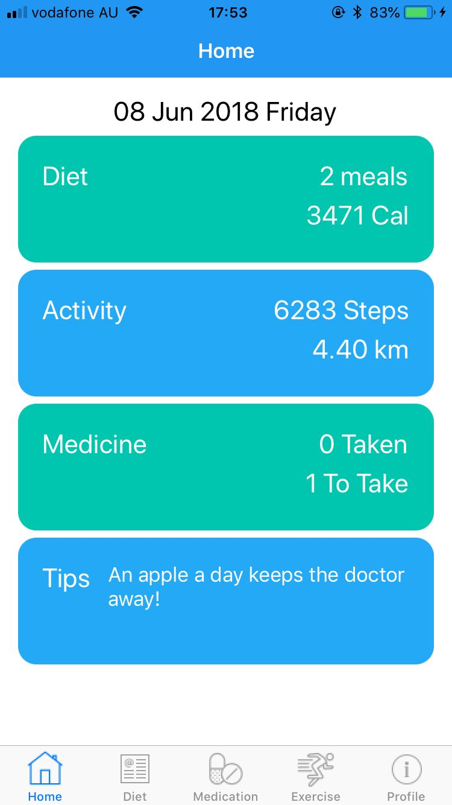

# MyDiet

The purpose of this project is to design an app for patients with chronic diseases, to record their daily diet and medications for better follow-up treatment.
There are five core targets for this app. 
1.	run at both IOS and Android platform.
2.	contain customer’s normal personal information and customer login with password.
3.	record diary diet, including time, food, photo of food and nutrition (calories, fat, protein carb, sugar and salt). 
4.	display daily exercise including steps, miles.
5.	record and remind about user’s medication.

Responsibility: This is a personal capstone project. I am taking the lead and also a high effective role in the project. I finished the design part, development and testing part independently. 

